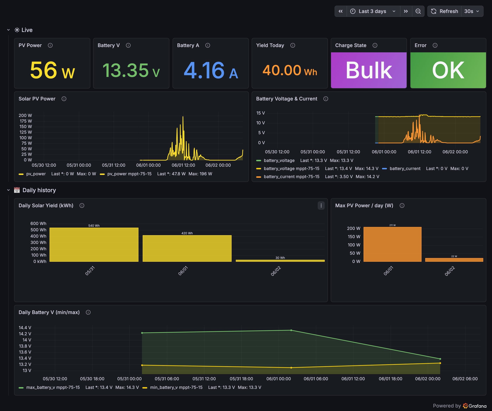
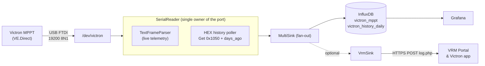
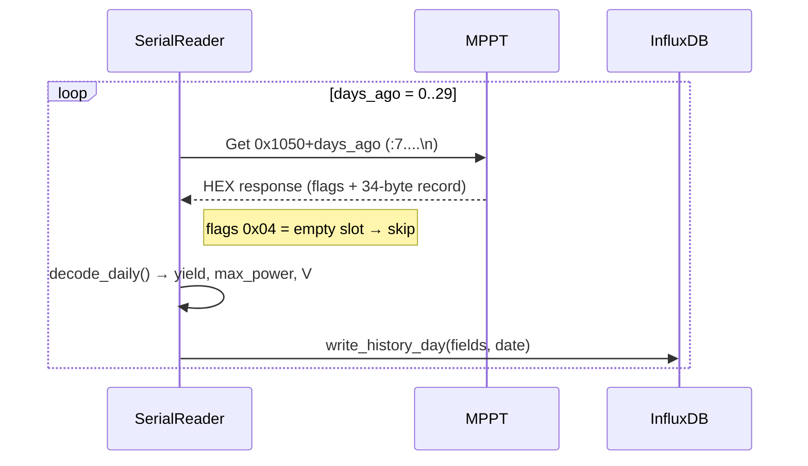
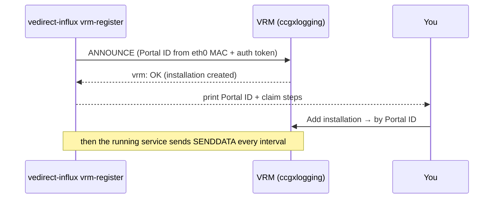

# vedirect-influx

[](https://github.com/ckeller42/vedirect-influx/actions/workflows/ci.yml)
[](LICENSE)
[](pyproject.toml)
[](https://github.com/astral-sh/ruff)
[](https://mypy-lang.org/)
[](https://pre-commit.com/)
[](https://github.com/gitleaks/gitleaks)
[](https://coderabbit.ai/)

Read **Victron VE.Direct** solar/charger data — both the live **text** stream *and* the
on-device **daily-history** records (via the read-only **HEX** protocol) — and ingest into
**InfluxDB** for Grafana.

Most VE.Direct tools only parse the text protocol, which exposes just today/yesterday/total
aggregates (`H19`–`H23`). The charger actually stores ~30 days of **daily history** on-device,
reachable only over the HEX protocol. `vedirect-influx` reads those history registers and
backfills them into InfluxDB — so Grafana shows real historic daily yield, **including days
before you started logging**.

Validated against a **SmartSolar MPPT 75/15** (PID `0xA075`, FW 1.74).



<sub>Regenerate this image: `python scripts/screenshot-dashboard.py --url <grafana> --uid <uid> --out docs/dashboard.png` (see script header).</sub>

## Features

- Live telemetry (battery V/I, PV V/W, charge state, yields, load) → InfluxDB
- **Daily-history backfill** (yield, max PV power, max/min battery voltage per day)
- Single process owns the serial port and multiplexes text + HEX
- **Read-only** — never writes charger settings; cannot misconfigure the device
- Pluggable `Sink` interface (InfluxDB included; stdout for debugging)
- Optional **Victron VRM Portal** upload — direct, **no Venus OS** ([see below](#victron-vrm-portal-direct-no-venus-os))
- Optional **Bluetooth source** — read a SmartSolar over BLE *Instant Readout* (no VE.Direct cable);
  set `source: ble` ([see below](#bluetooth-source-instant-readout))
- Config via YAML; secrets via env var / file (never in the repo)
- Ships a portable Grafana dashboard ([`deploy/grafana-victron.json`](deploy/grafana-victron.json))

## Architecture



Sinks implement a small `Sink` interface; `MultiSink` fans each sample out to all of them, so
VRM uploads run **alongside** InfluxDB and a failure in one never blocks the other.

Daily-history poll (read-only HEX), run on startup and once per day:



The decode offsets are calibrated by cross-checking against the text aggregates: day-0
yield == `H20`, day-1 == `H22`, max power == `H21`/`H23`, day-seq == `HSDS`.

## Installation

### From PyPI / Git

```bash
pip install vedirect-influx                                   # (when published)
pip install git+https://github.com/ckeller42/vedirect-influx  # latest
```

### From source (development)

```bash
git clone https://github.com/ckeller42/vedirect-influx
cd vedirect-influx
python -m venv .venv && . .venv/bin/activate
pip install -e ".[dev]"
pre-commit install && pre-commit install --hook-type pre-push   # local CI checks
pytest -q                                                       # run tests + doctests
```

### Stable serial device name (udev)

```bash
# /etc/udev/rules.d/99-victron.rules
KERNEL=="ttyUSB[0-9]*", ATTRS{idVendor}=="0403", ATTRS{idProduct}=="6015", MODE="0660", GROUP="dialout", SYMLINK+="victron"
```

```bash
sudo udevadm control --reload-rules && sudo udevadm trigger
```

### Configure

Copy [`deploy/config.example.yaml`](deploy/config.example.yaml) to `config.yaml` and set the
InfluxDB token via environment (never in the file):

```bash
export INFLUXDB_TOKEN=...        # or use an EnvironmentFile with systemd
```

### Run

```bash
vedirect-influx --config config.yaml --history-once   # one-off backfill / smoke test
vedirect-influx --config config.yaml                  # run continuously (live + history)
vedirect-influx -c config.yaml -v                     # verbose
```

### As a service (systemd)

```bash
sudo cp deploy/vedirect-influx.service /etc/systemd/system/
sudo install -d /etc/vedirect-influx
sudo cp deploy/config.example.yaml /etc/vedirect-influx/config.yaml
echo "INFLUXDB_TOKEN=..." | sudo tee /etc/vedirect-influx/secrets.env && sudo chmod 600 /etc/vedirect-influx/secrets.env
sudo systemctl enable --now vedirect-influx
```

> Deploying on a Raspberry Pi with an automated/AI agent? See [AGENTS.md](AGENTS.md) for a
> step-by-step runbook with per-step success checks.

## InfluxDB schema

- `victron_mppt` (live): `battery_voltage`, `battery_current`, `pv_voltage`, `pv_power`,
  `charge_state`, `tracker_mode`, `error_code`, `yield_today_kwh`, `load_on`, …
- `victron_history_daily` (one point per day at midnight UTC): `yield_kwh`, `max_power_w`,
  `max_battery_v`, `min_battery_v`, `day_seq`.

## Grafana

Import [`deploy/grafana-victron.json`](deploy/grafana-victron.json) and select your InfluxDB
(Flux) datasource when prompted.

## Bluetooth source (Instant Readout)

Read the SmartSolar over **Bluetooth** instead of the VE.Direct USB cable — flip one config field:

```yaml
source: ble                          # "serial" (default) | "ble"
ble:
  mac: DA:4B:25:C4:61:34             # the charger's BLE MAC
  key_file: /etc/vedirect-influx/ble_key.txt   # Instant Readout encryption key (0600)
```

Install the extra and store the key (VictronConnect → device → ⚙ → Product info →
"Instant readout via Bluetooth" → **Show**):

```bash
pip install "vedirect-influx[ble]"
install -m600 /dev/stdin /etc/vedirect-influx/ble_key.txt <<< "<32-hex-key>"
```

**Switching between USB and Bluetooth is just the `source` field** — no code change; restart the
service. The charger broadcasts AES-encrypted adverts decoded with your key (passive, no pairing).

> ⚠️ BLE Instant Readout carries a **live subset only**: battery V/I, PV power, yield today,
> charge state, error, load. It does **not** include `pv_voltage`, lifetime `yield_total`,
> `max_power`, `tracker_mode`, or the on-device **daily history** — those need VE.Direct (USB).
> Daily yield can be derived in Grafana from the logged `yield_today`.

## Victron VRM Portal (direct, no Venus OS)

Optionally upload the same data to the [VRM Portal](https://vrm.victronenergy.com) and the
**VRM app** (Victron's *monitoring* app) — *in addition* to InfluxDB — without running Venus OS.
This is **monitoring only**: the device appears on the VRM website and in the VRM app, **not in
VictronConnect** (VictronConnect-Remote needs a genuine GX — see [Limitations](docs/VRM.md#limitations)).
`vedirect-influx` speaks the same `log.php` upload a Venus GX device uses, identifying itself by a
**VRM Portal ID** derived from the host's ethernet MAC. One-time registration, then claim the
installation in VRM:



```bash
vedirect-influx -c config.yaml vrm-register --test   # connectivity ping → "vrm: OK"
vedirect-influx -c config.yaml vrm-register          # ANNOUNCE + print claim steps
```

Enable the sink (runs alongside InfluxDB) in `config.yaml`:

```yaml
vrm:
  enabled: true
  custom_name: "My MPPT"
  interval_s: 60
  auth_token_file: /etc/vedirect-influx/vrm_auth_token.txt
```

Full protocol, the field→code map, and caveats are in [docs/VRM.md](docs/VRM.md).

> ⚠️ This uses an **undocumented** Victron endpoint and presents as a GX device — intended for
> personal use with your own hardware. Victron may change it without notice.

## Related projects & references

This tool builds on the documented VE.Direct HEX protocol and prior MIT-licensed work. Its
**differentiator**: HEX **daily-history** decode **plus InfluxDB ingest** in one tool.

| Project | What it does | Relation |
| --- | --- | --- |
| [karioja/vedirect](https://github.com/karioja/vedirect) | Text-protocol parser | Text-decode approach |
| [simmonslr/vedirecthex](https://github.com/simmonslr/vedirecthex) | HEX GET/SET CLI | HEX framing reference |
| [krahabb/esphome-victron-vedirect](https://github.com/krahabb/esphome-victron-vedirect) | Full HEX+text for ESPHome | Record-decode reference |
| [thot-experiment/ve-direct-hex](https://github.com/thot-experiment/ve-direct-hex) | Barebones HEX+text | Related tooling |
| [jessedc/ve.direct-python](https://github.com/jessedc/ve.direct-python) | VE.Direct → InfluxDB (text only) | Closest prior art |

Authoritative spec: Victron
[VE.Direct Protocol](https://www.victronenergy.com/upload/documents/VE.Direct-Protocol-3.34.pdf)
and
[BlueSolar HEX protocol](https://www.victronenergy.com/upload/documents/BlueSolar-HEX-protocol.pdf).

## Development

```bash
pytest -q              # tests + doctests
ruff check . && ruff format --check .
mypy vedirect_influx
pre-commit run --all-files
```

## License

[MIT](LICENSE)
