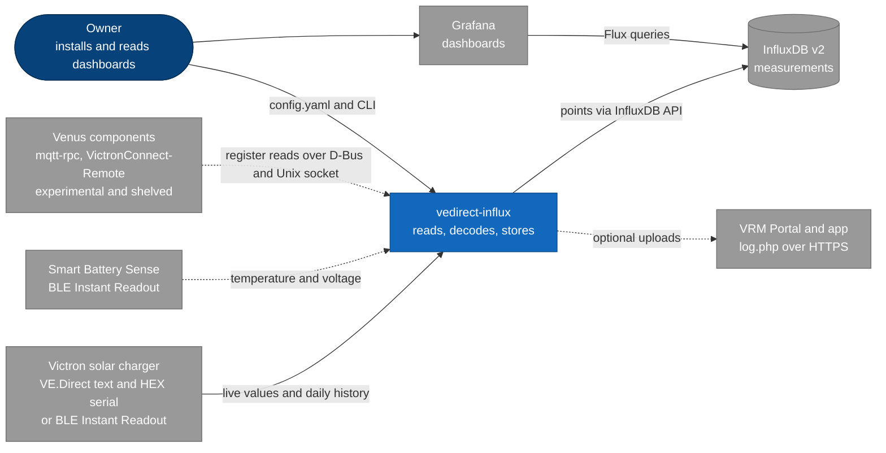
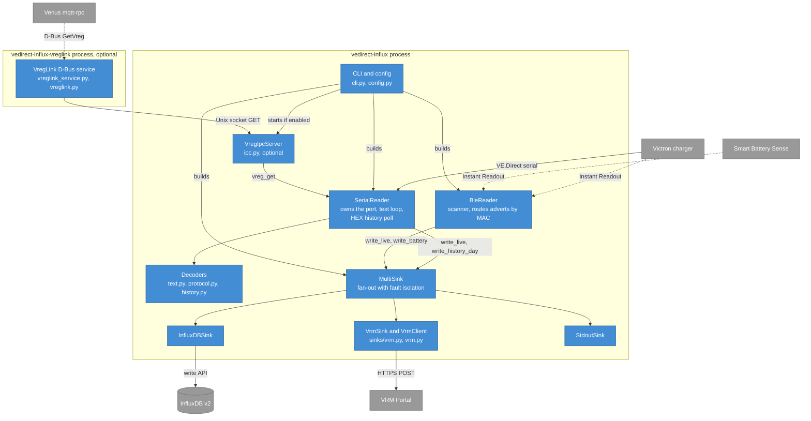
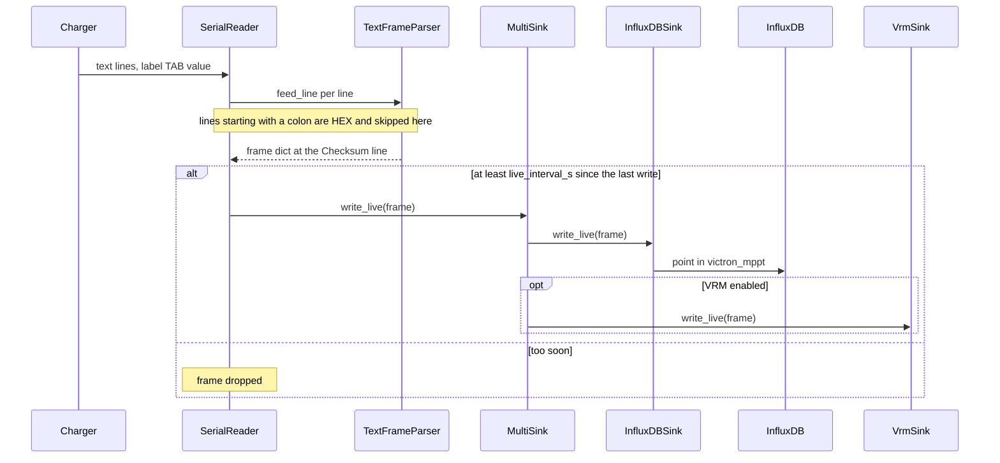
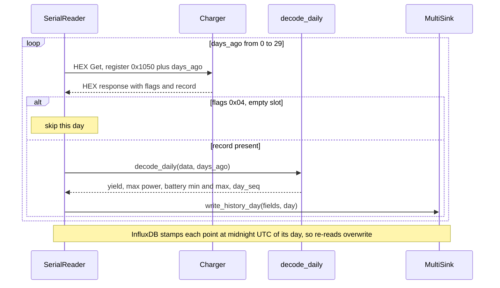
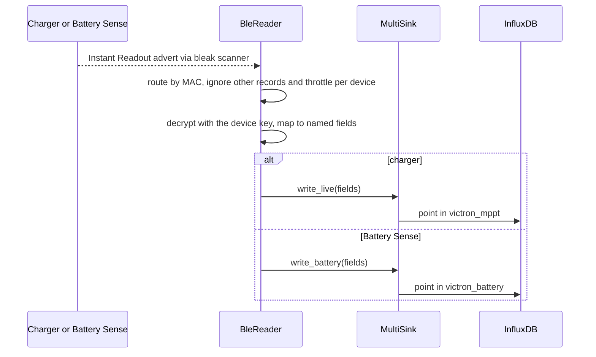
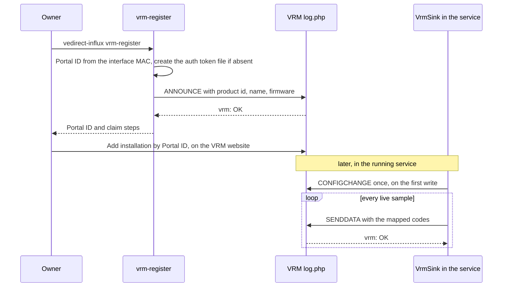
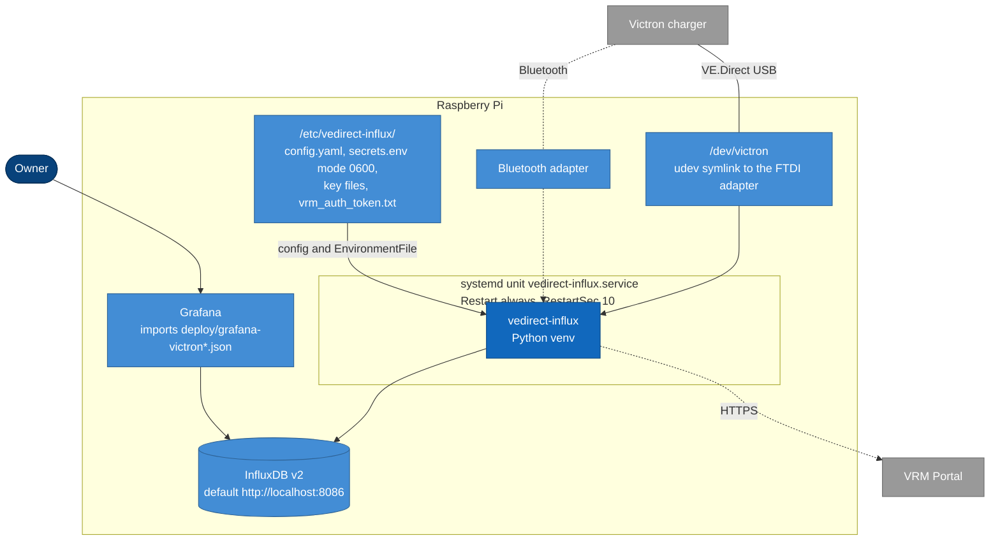

# Architecture

How `vedirect-influx` is built. Claims link to the code or a test.

## 1. Introduction and goals

`vedirect-influx` reads a Victron solar charger and stores what it reports. Most VE.Direct tools
parse only the live text stream, which exposes today and yesterday aggregates. The charger also
keeps about 30 days of history on the device, reachable only through the HEX protocol. This
project reads both, so Grafana shows real daily yield including days before logging began.

| Goal | What it means |
| --- | --- |
| Complete data | Live telemetry plus the on-device daily history in InfluxDB |
| Harmless to the device | Read-only toward the charger, it cannot change a setting |
| Two ways in | VE.Direct serial cable or Bluetooth Instant Readout, chosen by one config field |
| Optional extra outputs | VRM Portal upload alongside InfluxDB, no Venus OS |
| Unattended operation | Runs as a systemd service on a Raspberry Pi and recovers from errors |

Stakeholders: the owner running a camper or off-grid system (installs, reads Grafana), and
contributors (see
[`AGENTS.md`](https://github.com/ckeller42/vedirect-influx/blob/main/AGENTS.md)).

## 2. Constraints

- **Python 3.11 or newer**, tested on 3.11 to 3.13. The deploy target runs 3.13.
- **One owner per serial port.** The VE.Direct port has a single reader. The reader multiplexes
  the text stream and HEX requests itself; no other process may open the port.
- **HEX is read-only.** Only the Get command (and the device's Async responses) are implemented
  in [`protocol.py`](https://github.com/ckeller42/vedirect-influx/blob/main/vedirect_influx/protocol.py).
- **No secrets in the config file.** The InfluxDB token comes from the environment, BLE keys and
  the VRM token from separate `0600` files.
- **Instant Readout is a subset.** BLE adverts carry no history and fewer live fields.
- **The VRM upload uses an undocumented Victron endpoint** and identifies as a GX device. Personal
  use with your own hardware only.
- **Measurement and field names are a contract** with the shipped Grafana dashboards.

## 3. Context and scope

The system sits between one Victron charger (plus an optional Battery Sense) and the places the
data is read: InfluxDB with Grafana, and optionally the VRM Portal.

| Neighbour | Interface | Direction |
| --- | --- | --- |
| Charger | VE.Direct serial 19200 8N1 (text stream and HEX Get), or BLE Instant Readout adverts | in |
| Smart Battery Sense | BLE Instant Readout adverts, own MAC and key | in |
| InfluxDB v2 | InfluxDB client write API, token from the environment | out |
| Grafana | reads InfluxDB, two dashboards ship in [`deploy/`](https://github.com/ckeller42/vedirect-influx/tree/main/deploy) | none directly |
| VRM Portal | form-encoded HTTPS POST to `ccgxlogging.victronenergy.com`, see [VRM upload protocol](VRM.md) | out |
| Venus components | VReg reads over a Unix socket, see [VictronConnect-Remote scope](vcr-component-assembly-scope.md) | in, dormant |

VictronConnect itself talks to the charger over its own Bluetooth link and is not part of this
system.

## 4. Solution strategy

| Problem | Approach | Where |
| --- | --- | --- |
| Two different input paths | A reader per source with the same output shape: a dict of named fields handed to a sink | `SerialReader`, `BleReader` |
| Text and HEX share one port | One reader owns the port and takes a lock for each HEX exchange, so the text loop and on-demand reads interleave | `SerialReader._serial_lock` |
| Several destinations that must not hurt each other | A `Sink` interface and a fan-out `MultiSink` that logs and swallows a failing sink | `sinks/` |
| Decoding logic must be testable without hardware | Parsers are pure functions or classes over bytes, covered by doctests and fixtures | `text.py`, `protocol.py`, `history.py` |
| Optional hardware libraries | Imported lazily, so serial-only installs need no BLE or D-Bus stack | `cli.py`, `pyproject.toml` extras |
| History written repeatedly | History points are stamped at the day's midnight UTC, so a re-read overwrites | `sinks/influx.py` |

## 5. Building block view

### Level 1 and 2: containers

One Python process holds everything except the optional D-Bus service, which is a second process
that talks to the first over a Unix socket.

### Level 3: modules

| Module | Role | Evidence |
| --- | --- | --- |
| [`cli.py`](https://github.com/ckeller42/vedirect-influx/blob/main/vedirect_influx/cli.py) | Entry point. Commands `run`, `history-once`, `vrm-register`. Builds sinks (`build_sinks`, `make_sink`) and the reader (`make_reader`); starts the IPC server for a serial source when enabled | `tests/test_cli_wiring.py` |
| [`config.py`](https://github.com/ckeller42/vedirect-influx/blob/main/vedirect_influx/config.py) | `Config` dataclass and `Config.load` (YAML to fields). Reads key files lazily | `tests/test_cli_wiring.py` |
| [`reader.py`](https://github.com/ckeller42/vedirect-influx/blob/main/vedirect_influx/reader.py) | `SerialReader`: opens the port, feeds text lines to the parser, throttles live samples, polls the 30 history registers at start and once per day, serves `vreg_get` | `tests/test_reader_vreg.py` |
| [`ble.py`](https://github.com/ckeller42/vedirect-influx/blob/main/vedirect_influx/ble.py) | `BleReader`: one scanner, routes each advert by MAC to a field mapper (`solar_fields`, `battery_sense_fields`) and a sink writer | `tests/test_ble.py` |
| [`text.py`](https://github.com/ckeller42/vedirect-influx/blob/main/vedirect_influx/text.py) | `TextFrameParser`: collects `label TAB value` lines until `Checksum`, scales to named fields | doctest in the module, `tests/test_text.py` |
| [`protocol.py`](https://github.com/ckeller42/vedirect-influx/blob/main/vedirect_influx/protocol.py) | HEX framing: `build_get`, `parse_frame`, `checksum`. Get and Async only | doctests in the module |
| [`history.py`](https://github.com/ckeller42/vedirect-influx/blob/main/vedirect_influx/history.py) | Register numbers (`0x1050 + days_ago`) and `decode_daily` to a `DailyRecord` | `tests/test_history.py` |
| [`sinks/base.py`](https://github.com/ckeller42/vedirect-influx/blob/main/vedirect_influx/sinks/base.py) | `Sink` interface: `write_live`, `write_history_day`, optional `write_battery` and `close` | `tests/test_multisink.py` |
| [`sinks/influx.py`](https://github.com/ckeller42/vedirect-influx/blob/main/vedirect_influx/sinks/influx.py) | `InfluxDBSink`: three measurements, tags, stable field types | `tests/test_influx.py` |
| [`sinks/vrm.py`](https://github.com/ckeller42/vedirect-influx/blob/main/vedirect_influx/sinks/vrm.py) | `VrmSink`: field to VRM code map, one `CONFIGCHANGE`, `SENDDATA` per live sample | `tests/test_vrm_sink.py` |
| [`sinks/stdout.py`](https://github.com/ckeller42/vedirect-influx/blob/main/vedirect_influx/sinks/stdout.py) | `StdoutSink`: prints records, for debugging | none |
| [`sinks/multi.py`](https://github.com/ckeller42/vedirect-influx/blob/main/vedirect_influx/sinks/multi.py) | `MultiSink`: calls each sink, logs and swallows exceptions | `tests/test_multisink.py` |
| [`vrm.py`](https://github.com/ckeller42/vedirect-influx/blob/main/vedirect_influx/vrm.py) | `VrmClient` and `vrm_encode`: the `log.php` protocol, Portal ID, pinned CA | `tests/test_vrm.py` |
| [`ipc.py`](https://github.com/ckeller42/vedirect-influx/blob/main/vedirect_influx/ipc.py) | `VregIpcServer` and `vreg_ipc_get`: line protocol `GET` over a Unix socket, `SET` rejected | `tests/test_ipc.py` |
| [`vreglink.py`](https://github.com/ckeller42/vedirect-influx/blob/main/vedirect_influx/vreglink.py) | Pure request logic: reads proxy to IPC, writes return status `0x8102` | `tests/test_vreglink.py` |
| [`vreglink_service.py`](https://github.com/ckeller42/vedirect-influx/blob/main/vedirect_influx/vreglink_service.py) | D-Bus `solarcharger` service with `VregLink`. Pi only, not run by CI | none (device only) |

## 6. Runtime view

### 6.1 Live text stream to InfluxDB (serial)

The reader reads continuously. A text block ends at the `Checksum` line, which completes a frame.
Only one frame per `live_interval_s` is written; the others are dropped.

On a `SerialException` the reader closes, waits 10 seconds and reopens the port, then repeats the
startup history poll.

### 6.2 Daily-history HEX read

Run once at startup (`history.poll_on_start`) and then once per day after `history.daily_at`.
Each register read holds the serial lock for that exchange only, so the text loop is not starved.

A request is retried up to three times with a two-second wait each. `history-once` runs the same
loop and exits (see the [CLI reference](reference/cli.md#history-once)).

### 6.3 Bluetooth advert to InfluxDB

### 6.4 VRM registration and upload

Registration is a one-time CLI call. After the owner claims the installation in VRM, the running
service uploads each live sample.

A failed POST returns false and is not retried; the next sample is the retry. Details of the
protocol and code map are in [VRM upload protocol](VRM.md).

## 7. Deployment view

The reference deployment is a Raspberry Pi in a vehicle ("buspi") running one systemd unit.
The step-by-step procedure is [Deploy on a Raspberry Pi](howto-deploy.md).

The unit file is
[`deploy/vedirect-influx.service`](https://github.com/ckeller42/vedirect-influx/blob/main/deploy/vedirect-influx.service).
InfluxDB may also be remote: `sink.url` decides. The serial and Bluetooth paths are alternatives
(`source`), not used together.

## 8. Crosscutting concepts

- **Configuration.** One YAML file mapped by `Config.load`; every key optional with a default.
  Reference: [configuration](reference/configuration.md).
- **Secrets.** Token from an environment variable, keys and tokens from `0600` files. Nothing
  secret is logged or committed.
- **Error handling.** The serial loop reopens the port after errors and never lets a failed
  history poll block live telemetry. `MultiSink` isolates sink failures. BLE restarts its scanner
  after an adapter error.
- **Logging.** The `vedirect_influx` logger to stderr, `-v` for debug. Under systemd this lands in
  the journal.
- **Data types.** Fixed per field so InfluxDB never sees a type conflict, see the
  [data contract](reference/data-contract.md#types-tags-and-time).
- **Testing.** pytest plus doctests over the package. Hardware-free: parsers take bytes and readers
  are driven with fakes.
- **Documentation.** Docstrings feed the [API reference](reference/api.rst); this page is the
  only architecture description.

## 9. Architecture decisions

| Decision | Reason | Trace |
| --- | --- | --- |
| Read-only HEX | The tool must not be able to misconfigure the charger | `protocol.py` implements Get and Async only |
| One reader owns the serial port, others go through IPC | The port has a single owner by nature | `ipc.py`, `reader.vreg_get` |
| `Sink` interface with fan-out | Add destinations without touching the readers | PR #10 (VRM sink) |
| VRM upload as a sink in the same process | Uses the same decoded frames, no Venus OS | PR #10 |
| BLE as a second source with the same field names | Existing sinks and dashboards keep working | PR #17, PR #18 |
| Smart Battery Sense in its own measurement with its own tags | The Sense must not be labelled as the charger | PR #23, PR #25 |
| VictronConnect-Remote shelved | It needs genuine Venus OS, the flag was never flipped by any signal tried | [VictronConnect-Remote scope](vcr-component-assembly-scope.md), PR #15 |
| Realtime VRM MQTT sink not merged | Only the HTTP upload is on `main` | branch `feat/vrm-realtime-mqtt` |

## 10. Quality requirements

| Quality | Scenario | How it is met |
| --- | --- | --- |
| Safety | A bug or bad config cannot change a charger setting | No write command exists in `protocol.py`; the IPC rejects `SET` (`tests/test_ipc.py`) |
| Fault isolation | VRM is unreachable | `MultiSink` swallows the error, InfluxDB writes continue (`tests/test_multisink.py`) |
| Availability | Cable pulled or adapter error | The reader reopens the port every 10 seconds |
| Data integrity | The service restarts, history is read again | Points at midnight UTC overwrite, no duplicates |
| Compatibility | A dashboard queries a field | Names and types are the [data contract](reference/data-contract.md) |
| Maintainability | A parser changes | Doctests calibrated on captured frames (`history.py`, `text.py`) |

## 11. Risks and technical debt

- **Undocumented VRM endpoint.** Victron can change or block it. Monitoring only, it never shows
  in VictronConnect.
- **Register offsets verified on one model.** The history decode was calibrated on a SmartSolar
  MPPT 75/15. Other models may differ.
- **At most two BLE devices.** The scanner supports a charger plus one Battery Sense (issue #22).
- **VregLink is dormant.** The D-Bus service has only been unit-tested at its pure logic, never
  run on a device, and the shared object path for the `BusItem` and `VregLink` is unproven.
- **`history-once` uses a private method.** `cli.py` calls `SerialReader._open()` directly.
- **Instant Readout limits.** No history, so the BLE dashboard derives daily values in Flux.

## 12. Glossary

| Term | Meaning |
| --- | --- |
| VE.Direct | Victron's serial interface: a text stream plus the HEX command protocol |
| HEX protocol | Request and response frames starting with a colon; here only Get is used |
| Register | A numbered value in the charger; the daily history is `0x1050` to `0x106D` |
| Instant Readout | Victron's encrypted Bluetooth advertisement with live values |
| Smart Battery Sense | Victron BLE battery temperature and voltage sensor |
| VRM | Victron Remote Management, the web portal and app |
| Portal ID | The VRM installation identifier, here the ethernet MAC without colons |
| GX device | Victron's controller (Cerbo, Venus OS). The VRM sink presents as one |
| VictronConnect-Remote | Configuring a charger through VRM, needs genuine Venus OS |
| VReg, VregLink | Victron register access, and its D-Bus interface used by VictronConnect-Remote |
| Sink | A destination for decoded data, see `Sink` |
